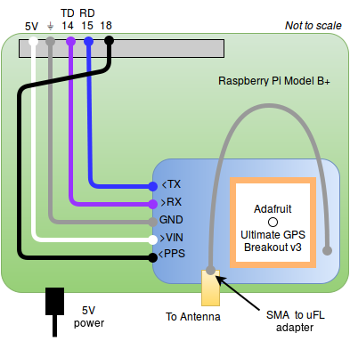
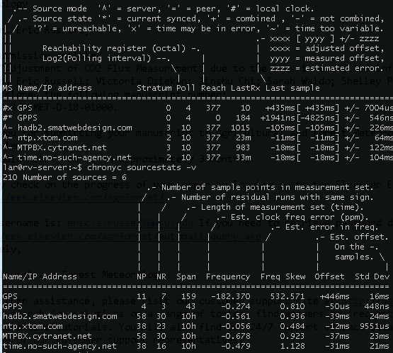

Rasbian NTP Server
==================

Setup guide for a Stratum 1 NTP server using GPS receiver & Raspberry Pi.

### Materials

Substitutions may apply. Your mileage may vary. Additional equipment
required for setup (i.e. keyboard, mouse, monitor).

* Raspberry Pi (Pi Zero not recommended)
    * a quality micro SD card (class 10 recommended)
    * a quality power supply
    * a case (to protect, and dampen temperature fluctuations)
* [Adafruit Ultimate GPS Breakout version 3](https://www.adafruit.com/products/746)
    * CR1220 Lithium Coin Cell Battery 3V
    * SMA to uFL/u.FL/IPX/IPEX RF Adapter Cable
    * GPS Antenna, External, Active, 3-5V 28dB 5m SMA
* Optional components for clock display:
    * [Adafruit 1.2" 4-Digit 7-Segment Display w/I2C Backpack - Red](https://www.adafruit.com/product/1270)
    * [Adafruit 0.56" 4-Digit 7-Segment Display w/I2C Backpack - Red](https://www.adafruit.com/product/878)

### Assembly

This diagram applies to the newer Pi Model 3 B+, and the original hardware
used for this project, the Pi Model 1 B+:



**TODO** add diagram for clock display components, and include
usage of prototyping board

### Software Setup

> Previously, this project used `ntpd` on *Raspbian Jessie*. Instructions
> are still provided for reference purposes [here](raspbian-jessie.md).

The latest version of this project is based on [Ubuntu Mate 16.04 LTS](ubuntu-mate.org)
with `chrony` and `gpsd`.

#### Enable serial port

The stock configuration for Raspberry Pi Model 3 B+ hardware is to present a login over
the hardware serial port, and to use the hardware uart to support Bluetooth connections
To enable the hardware serial port for use with the GPS receiver, first disable the login:
```
sudo raspi-config
```
```
Interfacing Options > Serial
```
* Would you like a login shell to be accessible over serial? **No**
* Would you like the serial port hardware to be enabled? **Yes**

#### Enable required kernel modules

```
sudo nano /boot/config.txt
```
```diff
 ...
+
+# Reclaim hardware UART for hardware serial port
+dtoverlay=pi3-miniuart-bt
+
+## pps-gpio
+##     Enable kernel support for GPS receiver pulse-per-second (PPS) input
+dtoverlay=pps-gpio
```
```
sudo reboot
```

#### Test the GPS connection

First, the serial port data stream:
```
sudo cat /dev/serial0
```

Next, the PPS input connection:
> Ensure the GPS has signal lock (slow ~15sec LED flashes) because it
> will not provide a PPS signal without full signal lock.

```
sudo apt-get install pps-tools -y
```
```
sudo ppstest /dev/pps0
```
```
trying PPS source "/dev/pps0"
found PPS source "/dev/pps0"
ok, found 1 source(s), now start fetching data...
source 0 - assert 1455208600.181885044, sequence: 480 - clear  0.000000000, sequence: 0
source 0 - assert 1455208601.265220834, sequence: 481 - clear  0.000000000, sequence: 0
source 0 - assert 1455208602.348548499, sequence: 482 - clear  0.000000000, sequence: 0
```

#### Configure GPS module

The Adafruit Ultimate GPS Breakout v3 sends 5 NMEA sentences by default. These
extra sentences introduce unnecessary processing and increase jitter. 

To disable all but the Recommended Minimum GPS data sentence (GPRMC), issue the 
`PMTK314` command as described in the 
[command packet](https://www.adafruit.com/datasheets/PMTK%20command%20packet-Complete-C39-A01.pdf)
(pg 12). 
```
sudo bash -c "echo -e '$PMTK314,0,1,0,0,0,0,0,0,0,0,0,0,0,0,0,0,0,0,0*29\r\n' > /dev/gps0"
```

Optionally ensure any future re-configuration is handled automatically by adding
a daily crontab entry:
```
sudo crontab -e
```
```diff
 ...
+# send modem configuration string everyday at noon (@reboot simply does not work)
+0 12 * * * echo -e '$PMTK314,0,1,0,0,0,0,0,0,0,0,0,0,0,0,0,0,0,0,0*29\r\n' > /dev/serial
```

#### Remove DHCP hook

To prevent the Pi from getting NTP configuration from any DHCP
servers, remove `ntp-servers` from the end of the `request` block:
```
sudo nano /etc/dhcp/dhclient.conf
```
```diff
 ...
 request subnet-mask, broadcast-address, time-offset, routers,
         ...
-        rfc3442-classless-static-routes, ntp-servers;
+        rfc3442-classless-static-routes;
 ...
```

#### Install `gpsd`

```
sudo apt-get install gpsd gpsd-clients -y
```

Update config file:
```
sudo nano /etc/default/gpsd
```
```diff
-DEVICES=""
+DEVICES="/dev/serial0"

 # Other options you want to pass to gpsd
-GPSD_OPTIONS=""
+GPSD_OPTIONS="-n"
```

Reboot, then test:
```
gpsmon -n
```

#### Install `chrony`

In latest versions of Raspbian, *ntp* is replaced by a client-only 
*systemd* NTP implementation. Disable it and install *chrony* instead:
```
sudo systemctl stop prefer-timesyncd.service
sudo systemctl disable prefer-timesyncd.service
sudo apt-get install chrony -y
```

And configure for use with GPS device:
```
sudo nano /etc/chrony/chrony.conf
```
```diff
+refclock SHM 0 offset 0 delay 0 refid GPS noselect
+refclock PPS /dev/pps0 lock GPS refid GPPS
 pool 2.debian.pool.ntp.org offline iburst
```

> From the [`chrony.conf` docs](https://chrony.tuxfamily.org/doc/3.4/chrony.conf.html):
> * `refclock` specifies a hardware reference clock
>     * `SHM` is the shared memory driver, which is utilized by *gpsd*
>     * `PPS` is for pulse-per-second signals, read from `/dev/pps0`
> * `lock` is used to link PPS samples to another *refclock*
> * `noselect` is an optional flag used to signal the GPS shouldn't be used directly
> * `refid` is the tracking label, "GPPS" indicates a PPS-enabled GPS source
> * `offset` and `delay` are values which will be tuned after running overnight

At this point, test the time synchronization using:
* `chronyc tracking`
* `chronyc sources -v`
* `chronyc sourcestats -v`

If necessary, apply a step-change to system clock:
> The `-a` argument is required in older versions of *chronyc* to prevent an error.

```
sudo chronyc -a makestep
```

Immediately after starting, the sources may not provide a good
time signal:


After running overnight, with a good GPS signal, you should
obtain a lock to the *GPPS* refclock:




#### Fine Tuning

After warming up, the **GPS** refclock showed an **Offset** value
consistently between 400-500ms, generally on the higher end. 
This value can be incorporated directly to improve the source:
```
sudo nano /etc/chrony/chrony.conf
```
```diff
-refclock SHM 0 offset 0 delay 0 refid GPS noselect
+refclock SHM 0 offset 0 delay 0.5 refid GPS noselect
 refclock PPS /dev/pps0 lock GPS refid GPPS
```


### References

* https://spellfoundry.com/2016/05/29/configuring-gpio-serial-port-raspbian-jessie-including-pi-3/
* https://chrony.tuxfamily.org/doc/3.4/chrony.conf.html
* http://robotsforroboticists.com/chrony-gps-for-time-synchronization/


